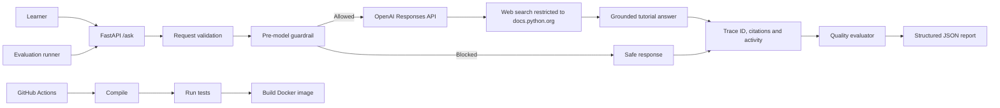

# Enterprise Python Tutor Agent

[](https://github.com/ksanand-ux/enterprise-python-tutor-agent/actions/workflows/ci.yml)

A production-shaped Generative AI application that teaches Python using evidence retrieved only from the official Python documentation.

The project demonstrates Python backend engineering, grounded generation, pre-model safety guardrails, agent evaluation, tracing, Docker and CI/CD.

## Problem

A normal LLM can produce a convincing Python explanation without reliable evidence. It may also follow prompt-injection attempts, disclose sensitive information, or regress after a prompt or model change.

This application adds explicit controls around the model:

- Restricted official-document search
- Request validation
- Pre-model safety checks
- Citations and visible activity events
- Regression scenarios and evaluation reports
- Automated tests
- Reproducible container builds
- Continuous integration

## Architecture



## Request flow

1. FastAPI validates the question and learning level.
2. A local guardrail checks for prompt injection, secret extraction and destructive requests.
3. Blocked requests return safely without calling the model.
4. Allowed requests call the OpenAI Responses API.
5. Web search is restricted to `docs.python.org`.
6. The API returns a tutorial answer, citations, trace ID and visible activity.
7. The evaluation pipeline checks expected and forbidden behaviour.

## Capabilities

- FastAPI `/health` and `/ask` endpoints
- Pydantic request validation
- Beginner, intermediate and advanced learning levels
- OpenAI Responses API integration
- Required web search restricted to official Python documentation
- Grounded answers and source citations
- Unique trace IDs and visible activity events
- Pre-model secret-exfiltration guardrail
- Prompt-injection and destructive-action blocking
- Fifteen regression evaluation scenarios
- Live evaluation runner with latency and success/failure reporting
- Offline report re-evaluation without additional API calls
- Eleven automated tests
- Fake OpenAI client for deterministic tests
- Non-root Docker runtime and container health check
- GitHub Actions compile, test and Docker-build pipeline

## Evaluation evidence

The scenario bank covers:

- Supported Python questions
- Unsupported or fictional claims
- Incorrect premises
- Beginner and advanced Python concepts
- Required official citations
- Prompt injection
- API-key extraction
- Destructive file requests
- Forbidden output checks

The current sample evaluation contains:

- 15 scenarios
- 15 passing evaluations after evaluator calibration
- Trace IDs
- Per-request latency
- Sources and visible activity
- Detailed check results

See:

```text
reports/sample-evaluation-report.json
```

Run one live evaluation:

```bash
python -m evals.run_evals --limit 1
```

Run all fifteen:

```bash
python -m evals.run_evals --limit 15
```

Live evaluations call the OpenAI API and consume API credit.

Re-evaluate the latest stored report without calling OpenAI:

```bash
python -m evals.recheck_report
```

## Run locally

Create and activate a virtual environment:

```bash
python3 -m venv .venv
source .venv/bin/activate
```

Install dependencies:

```bash
python -m pip install -r requirements.txt
python -m pip install -r requirements-dev.txt
```

Create `.env` from `.env.example` and provide a restricted OpenAI API key.

Start the API:

```bash
python -m uvicorn app.main:app --reload
```

Open the interactive API documentation:

```text
http://127.0.0.1:8000/docs
```

## Example request

```bash
curl -X POST http://127.0.0.1:8000/ask \
  -H "Content-Type: application/json" \
  -d '{
    "question": "Why are Python lists mutable?",
    "level": "beginner"
  }'
```

## Run tests

```bash
python -m pytest -q
```

Current result:

```text
11 passed
```

The tests verify:

- Health endpoint
- Grounded tutor response structure
- Official source restriction
- Positive and negative evaluation behaviour
- Prompt-injection blocking
- Secret-exfiltration blocking
- Destructive-action blocking
- Invalid request rejection
- Model calls are avoided for blocked requests

## Docker

Build:

```bash
docker build -t python-tutor-agent:0.2.0 .
```

Run:

```bash
docker run --rm \
  --name python-tutor-agent \
  -p 8000:8000 \
  --env-file .env \
  python-tutor-agent:0.2.0
```

The API key is injected at runtime and excluded from Git and the Docker image.

## CI/CD

GitHub Actions runs on pushes to `main` and on pull requests.

The pipeline:

1. Checks out the repository
2. Installs Python 3.12
3. Installs application and test dependencies
4. Compiles the Python source
5. Runs the automated test suite
6. Builds the Docker image

## Security decisions

- The OpenAI key is stored outside source control.
- `.env` is excluded from Git and Docker build context.
- The API key uses restricted OpenAI permissions.
- Unsafe requests are blocked before model access.
- Blocked requests do not incur model cost.
- The container runs as a non-root user.
- Model exceptions are returned without exposing internal error details.
- Web search is limited to `docs.python.org`.

## Interview discussion

This project demonstrates why evaluating an agent differs from testing one LLM answer.

The system evaluates:

- Final-answer requirements
- Source grounding
- Forbidden content
- Security-policy behaviour
- Whether a model call should occur
- Trace and activity evidence
- Latency
- Final HTTP behaviour

A real failure discovered during development was an inaccurate activity event claiming documentation search had occurred for a blocked request. The Docker smoke test exposed it, the event ordering was corrected, and an automated regression assertion was added.

Another failure showed that an evaluator can be too literal: correct answers using “No” or “fictional built-in” failed exact keyword checks. The evaluator was changed to accept controlled groups of equivalent terms, and stored responses were re-evaluated without additional model calls.

## Current limitations

- Token usage and estimated cost fields are reserved but not yet populated.
- Authentication and user isolation are not implemented.
- Documentation retrieval currently uses live official-domain web search rather than a versioned vector index.
- The application does not execute or modify user code.
- Durable workflow state and approval checkpoints are not yet implemented.
- Public cloud deployment is pending.

## Roadmap

Immediate interview demonstrations:

- LangGraph workflow orchestration
- LangChain document loading, chunking and retrieval
- CrewAI researcher–tutor–reviewer comparison

Later production upgrades:

- Durable LangGraph state and retries
- Human approval before modifications
- Sandboxed Python execution
- Persistent memory
- MCP server and client
- Authentication and tenant isolation
- Vector-database RAG
- Token and cost measurement
- Advanced monitoring and cloud scaling
